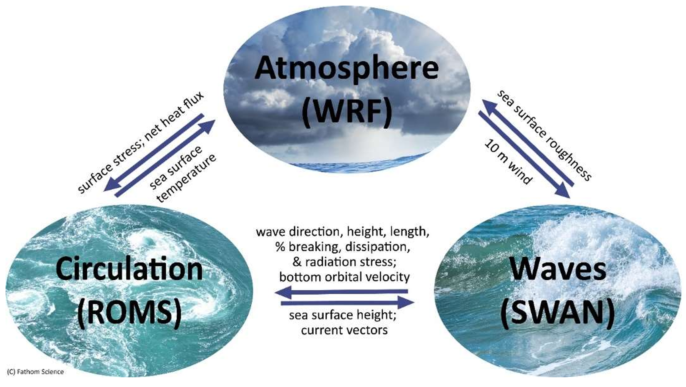

# Configurations

## Model's Components
At its core, InaCAWO consists of three numerical models, e.g. WRF (Weather Research and Forecasting), SWAN (Simulating Wave Nearshore), and ROMS (Regional Ocean Modelling System). The 3-way coupled forecast system is presently fully operational running the COAWST (Coupled-Ocean-Atmosphere-Wave-Sediment Transport) Modeling System on the BKMG HPC.

During the parallel execution, InaCAWO allows the direct exchange of critical metocean surface data between the models (shown in Figure 1 below). That is, each model is “aware of” and concurrently responds to the other models, much as these processes occur in nature. This is done through a [Model Coupling Toolkit (MCT)](https://web.cels.anl.gov/projects/climate/mct/){:target="_blank"}. 

<figure markdown="span">
    
    <figcaption>Figure 1. InaCAWO Diagram of Standalone model.</figcaption>
</figure>

## Geographical Extent and Grid Spacing

A high-resolution (0.25deg, approximately 3-km) is covering Indonesia region (90-145E & 15S-15N) serve as the domain of the InaCAWO model. Within this domain, there are 1130 latitudinal “rows” and 2040 longitudinal “columns” that constitute a single 2D slice of the domain, amounting to 2,305,000 compute points per 2 dimensional (2D) slab per variable. 

<figure markdown="span">
    
    <figcaption>Figure 2. InaCAWO Domain.</figcaption>
</figure>

There are 70-vertical sigma layers in the ocean (ROMS) component, and 48 atmospheric WRF layers. Since the SWAN wave model is 2D in spectral-space, it's additional “layers” are defined by the spectral truncation needed to resolve wind-driven and swell-driven components at the 3km spatial scale.  This means that at minimum, the number of compute points per prognostic state variable (combining ocean and atmosphere) amounts to ~(48+70+1)* 2,305,000 == 274,318,800, each of which must be solved at a computational timestep small enough to prevent numerical instability based on the well-known CFL requirement (as applied separately to ocean and atmosphere).  

## Input Data
*work in progress*

## Supporting Tools
*work in progress*

## Computational Resources Usage
*work in progress*