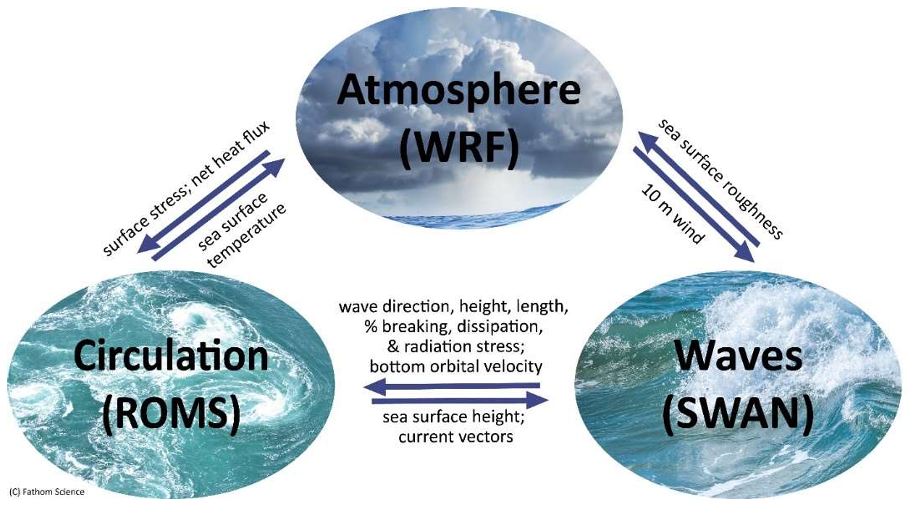
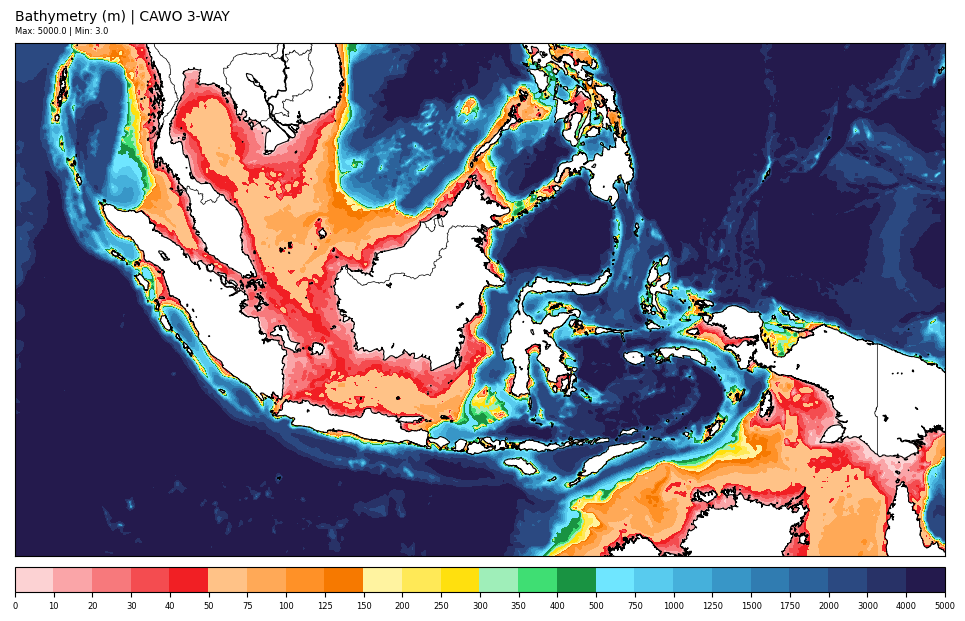

# Configurations

## Model components

At its core, InaCAWO consists of three numerical models — **WRF** (Weather Research and Forecasting), **SWAN** (Simulating WAves Nearshore), and **ROMS** (Regional Ocean Modelling System). The three-way coupled forecast system runs the COAWST modelling system on the BMKG HPC.

During parallel execution, InaCAWO allows direct exchange of critical metocean surface data between the models (shown in Figure 1 below). Coupling is implemented through the [Model Coupling Toolkit (MCT)](https://web.cels.anl.gov/projects/climate/mct/).

<figure markdown="span">
    
    <figcaption>Figure 1. InaCAWO diagram of standalone and coupled model components.</figcaption>
</figure>

## Geographical extent and grid spacing

A high-resolution domain (0.025°, approximately 3 km) covers the Indonesia region (90–145°E and 15°S–15°N). Within this domain there are 1,130 latitudinal rows and 2,040 longitudinal columns per 2D slice, amounting to **2,305,000** compute points per variable per horizontal slab.

<figure markdown="span">
    
    <figcaption>Figure 2. InaCAWO modelling domain.</figcaption>
</figure>

Vertical discretization:

| Component | Vertical levels |
| :--- | :--- |
| ROMS (ocean) | 70 sigma layers |
| WRF (atmosphere) | 48 eta layers |
| SWAN (waves) | 2D in spectral space (frequency and direction bins) |

At minimum, the number of compute points per prognostic state variable amounts to approximately **(48 + 70 + 1) × 2,305,000 ≈ 274 million**, each solved at a timestep constrained by the CFL stability requirement for ocean and atmosphere separately.

## Input data

InaCAWO uses a hierarchical primary/backup strategy for global model data that provides initial and boundary conditions (IC/BC) to WRF, ROMS, and SWAN.

### Primary sources

**ECMWF IFS** (atmosphere and waves) — used preferentially at 00 and 12 UTC cycles:

| Parameter | Value |
| :--- | :--- |
| Update cycles | 00, 06, 12, 18 UTC |
| Forecast window | 10 days (00/12 UTC); 90 hours (06/18 UTC) |
| Domain | 89.5–145.5°E, 15.5°S–15.5°N |
| 3D variables | Geopotential height, temperature, U/V wind, relative humidity (21 pressure levels) |
| 2D variables | 10 m wind, 2 m temperature/dewpoint, surface pressure, MSLP, SST, soil fields, sea ice |
| Wave variables | Significant wave height, mean/peak period, mean wave direction |

**CMEMS Mercator** (ocean) — primary ocean IC/BC:

| Parameter | Value |
| :--- | :--- |
| Product | `GLOBAL_ANALYSIS_FORECAST_PHY_001_024` |
| Update | Daily |
| Domain | 89–146°E, 16°S–16°N |
| Variables | Salinity, potential temperature, U/V currents, sea surface height |
| Depth | 50 vertical levels (0.5–5,275 m) |

### Backup sources

When primary data are unavailable, the system automatically switches to:

**GFS/GFSWAVE** (atmosphere and waves) and **HYCOM GOFS 3.1** (ocean, ESPC version):

| Model | Update | Domain | Notes |
| :--- | :--- | :--- | :--- |
| GFS | 00, 06, 12, 18 UTC | 89.5–145.5°E, 15.5°S–15.5°N | 31 pressure levels; used for all off-cycle (06/18 UTC) runs |
| GFSWAVE | 00, 06, 12, 18 UTC | Same | Wave boundary conditions for SWAN |
| HYCOM | Daily | 89.52–145.52°E, 15.36°S–15.36°N | 41 layers, 3-hourly; 6-hourly increments for spin-up |

!!! info
    ECMWF-based datasets are prioritized at 00 and 12 UTC when timely. ECMWF data are not available for off-cycle runs (06/18 UTC), which use GFS exclusively. Download tracking jobs report status to Zabbix for operator monitoring.

## Supporting tools

The operational system relies on several software layers beyond the coupled model itself:

| Tool | Purpose |
| :--- | :--- |
| **ROME** | Real-Time Operational Modeling Environment — cron scheduling, log monitoring, data-flow management |
| **Baron I/O API / m3tools** | NetCDF I/O and post-processing toolkit |
| **MATLAB scripts** | Pre-processing of global model data into ROMS/SWAN IC/BC and forcing files |
| **WRF Pre-Processing System (WPS)** | `ungrib`, `metgrid`, `real` — atmospheric IC/BC generation |
| **MCT** | Model coupling at runtime between WRF, ROMS, and SWAN |
| **Zabbix** | Workflow status messaging and alerting |
| **Internal web server** | Graphical display of forecast results (`mdc-cawo1` VM) |

Pre-processing is orchestrated via cron tables on the HPC. Log and status files track success or failure of each IC/BC preprocessing step.

## Computational resources

InaCAWO runs on the BMKG HPC (MDC) with separate accounts for development and production:

| Account | Login node | Purpose |
| :--- | :--- | :--- |
| `cawofcst_prod` | `mdclogin0` | Operational forecast production |
| `cawofcst_dev` | `mdclogin1` | Research and development |
| `cawofcst_test` | `mdclogin0` | Initial development and testing |

Key ROME environment paths on the production account:

| Variable | Path |
| :--- | :--- |
| `$RT_SCRIPTS` | `/home/cawofcst_prod/rome/oper/scripts` |
| `$RT_LOGS` | `/home/cawofcst_prod/rome/logs` |
| `$RT_MFI` | `/scratch/cawo_inputs` |
| `$RT_MFI_OUT` | `/scratch/cawo_outputs` |
| `$RT_DATA` | `/scratch/cawofcst_prod/data` |

The system runs **four forecast cycles per day**. On-cycle runs (00/12 UTC) produce 10-day (240-hour) forecasts; off-cycle runs (06/18 UTC) produce 90-hour forecasts. Six-hourly analysis cycling provides spun-up ocean initial conditions prior to each forecast launch.

Software repositories are maintained on GitLab (`https://mms.bmkg.go.id/gitlab/mms/inacawo-deployment/`) and deployed from gzipped tar archives on the HPC.

## References

- `InaCAWO_System_Initial_and_Boundary_Conditions_M1_482_v1.1.pdf` — IC/BC requirements and data sources
- `OM_InaCAWO_Software-Manual.pdf` — architecture, job scripts, and deployment (Baron Weather, 2024)
- `OM_InaCAWO_Related-Software-Manual.pdf` — ROME configuration and SOPs (Baron Weather, 2024)
