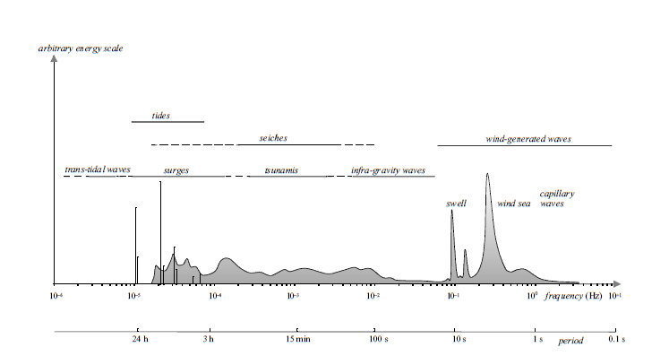
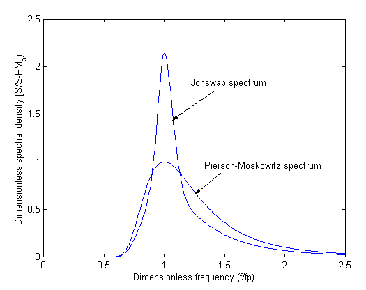
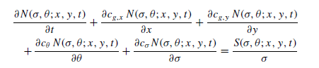

# Introduction to SWAN Model

## What is SWAN?

SWAN is a third-generation wave model for obtaining realistic estimates of wave parameters in coastal areas, lakes and estuaries from given wind, bottom and current conditions. However, SWAN can be used on any scale relevant for wind-generated surface gravity waves (waves that generated by wind and restored by gravity force). The model is based on the wave action balance equation with sources and sinks.

<figure markdown="span">
    
    <figcaption>Figure 1. Frequency and period of wave energy in the Munk (1950) model. SWAN simulates wind-generated waves which have 1-30 s of period (Holthuijsen, 2007). </figcaption>
</figure>

## Basic Theory

### Spectral Wave Models
As illustrated in the frequency distribution above, the real ocean surface is rarely a simple, perfectly regular wave. Instead, it is a chaotic and irregular mixture of waves with different heights, lengths, and directions moving simultaneously.

Because of this complexity, modern wave models like SWAN do not attempt to track the physical profile of individual waves moving through space and time. Instead, they use a **spectral approach**.

A **spectral wave model** calculates the ==evolution of wave energy==. It describes the sea state by looking at how wave energy is distributed across different **frequencies** (wave periods) and **directions**. You can think of a wave spectrum like an audio equalizer: just as an equalizer shows how much energy exists in the bass, mid, and treble frequencies of a song, a wave spectrum describes how much energy exists for different wave sizes and directions in the ocean.

By solving the energy balance equation, these models can realistically simulate how waves are:  
- **Generated** by wind.  
- **Propagated** across the ocean (as swell). 
- **Dissipated** due to factors like whitecapping, depth-induced breaking, or bottom friction.

To initialize a spectral wave model or define its boundary conditions, we need to prescribe a standard "shape" for this energy distribution. These shapes are derived from decades of real-world ocean observations. Two of the most commonly used empirical spectra for wind-generated waves are the **Pierson-Moskowitz** and **JONSWAP** spectra.

### JONSWAP spectrum
The Joint North Sea Wave Project (JONSWAP) spectrum is an empirical model used in ocean engineering to describe the ==energy distribution of growing, fetch-limited wind waves, commonly characterized by a sharp, pronounced peak in wave energy frequency==. It is a variant of the Pierson-Moskowitz (PM) spectrum developed from North Sea measurements, often used to simulate irregular sea states in numerical and physical modeling.  

<figure markdown="span">
     
    <figcaption>Figure xx. Comparison of Pierson-Moskowitz and JONSWAP Spectra (Abankwa, et al., 2015).</figcaption>
</figure>

Comparison of Pierson-Moskowitz and JONSWAP Spectra

| Feature / Characteristic | Pierson-Moskowitz (PM) Spectrum | JONSWAP Spectrum |
| :--- | :--- | :--- |
| **Sea State** | *Fully developed sea* | *Fetch-limited sea* (developing waves) |
| **Wind & Fetch Assumptions** | Wind blows constantly for a very long duration over a vast area (infinite *fetch*). | Wind blows with spatial (*fetch*) or temporal limitations. |
| **Spectrum Shape** | Broader energy distribution with a flatter peak. | Narrower energy distribution with a sharper, higher peak. |
| **Peak Enhancement Factor (γ)** | None (assumed equivalent to γ = 1). | Present (average value is typically γ = 3.3, ranging from 1 to 7). |
| **Main Input Parameters** | Wind speed (U10). | Wind speed (U10), *fetch* length (*F*), and the γ factor. |
| **Ideal Usage Area** | Open seas or oceans without significant land boundaries. | Coastal waters, semi-enclosed seas (e.g., North Sea, Java Sea), bays, or lakes. |

> **💡 Additional Note:**
> Mathematically, the JONSWAP spectrum is a modification of the Pierson-Moskowitz spectrum, multiplied by a peak enhancement factor (γ). If you set the value of γ = 1 in your SWAN configuration, the JONSWAP formulation will automatically yield the exact same results as the Pierson-Moskowitz spectrum.
### Governing Equation

The SWAN model solves the spectral action density balance equation which in Cartesian coordinates can be written as:

<figure markdown="span">
     
    <figcaption>Figure xx. Governing Equation of SWAN in Cartesian coordinates.</figcaption>
</figure>

N represents the action density spectrum, which is a function of **geographic coordinates (x,y)**, **time (t)**, **frequency (σ)**, and **direction (θ)**.  

The left-hand side of the equation describes the local rate (t) of change of action density and its propagation in geographic (in x and y axis), direction (θ) and frequency (σ). The right-hand side represents the source and sink terms that account for various physical processes affecting wave growth and dissipation, such as wind input, whitecapping, bottom friction, depth-induced breaking, and nonlinear wave-wave interactions. SWAN wave model based on ==implicit numerical schemes== to solve the action balance equation, which are ==always stable== and allow for larger time steps compared to explicit schemes. But, users can not choose an arbitrarily large time step, because accuracy may be compromised. In order to maintain accuracy, users need to know the characteristics of the phenomena to be simulated and select an appropriate time step accordingly.

Based on SWAN User Manual (Version 41.45, 2023), the recommended settings are as follows:

1. Direction resolution for wind sea (Δθ) : 15°-10°
2. Direction resolution for wind sea (Δθ) : 5°-2°
3. Frequency range (Δf/f) : 0.04 < f < 1
4. Spatial resolution (Δx, Δy) : 10 m - 1000 m
5. Time step (Δt) : 10 minutes, if larger time step is chosen, action density limiter becomes probably a part of the physics.

## Input Data

1. **Wind fields**. This data should cover the entire model domain, or bigger, and be provided at regular intervals to capture temporal variations. Data provided in u and v component (zonal and meridional).

2. **Bathymetry**. Information about the bathymetry (sea floor topography) of the area being modeled. This data should cover the entire model domain, or bigger.

3. **Boundary conditions data**. This data is optional, but highly recommended to reduce potential error near the boundary. Data provided along the open boundaries of the model domain. The data can be in the form of wave spectra at the open boundaries of the model domain, or wave parameters such as significant wave height (Hs), peak period (Tp), mean wave direction (Dm) and directional spread (Dspr).

4. **Initial conditions data**. This data is optional, but highly recommended to reduce the spin-up time of the model. Data provided at the start of the simulation period. Alternatively, users can run a spin-up simulation to generate initial conditions, which usually takes a week or two, prior the desired simulation period.

5. **Current data**. This data is optional, but can improve the accuracy of the simulation, especially in areas with strong currents. Data provided as u and v components (zonal and meridional) covering the entire model domain, or bigger.

Typically, users only need wind fields and bathymetry data as mandatory inputs to run the SWAN model. However, including boundary conditions, initial conditions, and current data can enhance the accuracy of the simulation results.

For further reading regarding this matter, please refer to the [SWAN User Manual](https://swanmodel.sourceforge.io/online_doc/swanuse/swanuse.html) and Waves in Oceanic and Coastal Waters by Holthuijsen (2007), especially in Chapter 9.

## Supporting Tools

For pre-processing and post-processing SWAN model data, several supporting tools can be utilized to facilitate these tasks:  

1. **Python or Matlab** : This tool will be useful for data preparation (wind fields, boundary conditions, initial conditions, current data) and visualization of SWAN output data.  

2. **Grid Generator** : Tools like SMS (Surface Water Modeling System) can be used to create unstructured triangular grids for SWAN simulations. Other grid generators include Oceanmesh-2D (Matlab-based), Triangle, etc could be used. As long as the generator's output is compatible with SWAN format (==fort.14==).

