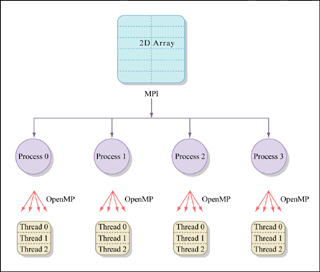
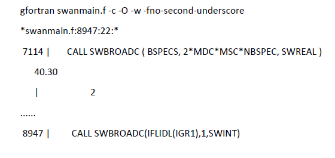
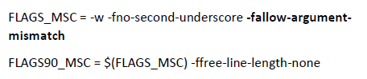

# Installation and Run

SWAN can be installed and run on various platforms, including Windows, Linux, and macOS. User can access the materials from following [link](https://swanmodel.sourceforge.io/download/download.html) and download the suitable version for their operating system. To perform simulation in small area, user can use the Windows version, but for large area simulation, it is recommended to use the Linux version for better performance and parallel processing capabilities.

SWAN can be installed on various modes, including:<br>

1. **Serial mode** : Suitable for small-scale simulations or testing purposes. In this mode, SWAN runs on a ==single processor core==. This mode usually the default for Windows platform. <br>

2. **Parallel mode** : Recommended for large-scale simulations or when high-resolution output is required. In this mode, SWAN can utilize multiple processor cores to speed up the computation. Parallel mode can be implemented using ==OpenMP== (for shared memory systems) or ==MPI== (for distributed memory systems).

A little bit explanation regarding OpenMP and MPI: <br>

1. **OpenMP** (Open Multi-Processing) is an API designed for shared-memory systems, allowing multiple threads to access a single pool of RAM simultaneously. It uses "directives" added to code (like C++ or Fortran) to easily distribute tasks across the different cores of a single CPU or computer. In the case of SWAN, ==OpenMP enables parallel processing by using multiple threads/cores within the same nodes/computers/machines==.

2. **MPI** (Message Passing Interface) is a standardized library for distributed-memory systems, where multiple independent computers (nodes) communicate over a network. Since these computers don't share RAM, MPI works by explicitly "sending" and "receiving" messages to synchronize data across the entire cluster. In the case of SWAN, ==MPI enables parallel processing by using multiple nodes within the same cluster==.


<figure markdown="span">
     
    <figcaption>Figure 3. Mixed Parallel Programming using MPI and OpenMP. (Figure by MIT OpenCourseWare.).</figcaption>
</figure>


## **Windows**

1. Download the Windows installer from the [SWAN website](https://swanmodel.sourceforge.io/).

2. Run the installer and follow the on-screen instructions to complete the installation.

3. Set up environment variables if necessary.

4. Important note = SWAN on Windows usually works in serial mode (only using one CPU core). For parallel simulation, consider using Linux or Windows Subsystem Linux (WSL) 2.
    
## **Linux** 

1. Install supporting libraries and compilers (e.g., gfortran).<br>
        ```bash
        sudo apt-get install wget nano gfortran m4 build-essential
        ```
2. Choose compilers<br>
        ```bash
        export FC=gfortran
        ```
3. Download desired SWAN version<br>
        ```bash
        wget https://swanmodel.sourceforge.net/download/zip/swan4145.tar.gz
        ```
4. Extract and navigate to the extracted directory<br>
        ```bash
        tar -xvzf swan4145.tar.gz && cd swan4145
        ```
5. Build using OMP (OpenMP) for parallel processing<br>
        ```bash
        perl switch.pl -unix _.ftn _.ftn90
        ```
6. Start compiling <br>
        ```bash
        make config
        ```
7. Compiling OMP <br>
        ```bash
        make omp
        ```

8. During the installation process, users may encounter an issue in the compilation step (Figure 4).

9. This issue can be resolved by modifying the ==macros.inc== to include the flag **-fallow-argument-mismatch** in the FFLAGS section (Fig. 5). This flag allows for more flexibility in argument matching during compilation, which can help resolve compatibility issues with certain Fortran compilers. 

10. Turn the swanrun file to an executable by using the command below:
    ```bash
    chmod +x swanrun swan.exe
    ```

11. Move the ==swanrun and swan.exe== files to the desired working directory where the user wants to run the SWAN model. 

12. To run the SWAN model, user need to make sure that the required files such as input files (wind and bathymetry), configuration/namelist file (.swn), initial and boundary condition files (if available) are in the same directory as the swanrun or swan.exe file. Then, execute the following command in the terminal or command prompt: <br>
    ```bash
    ./swanrun -input [your_namelist_file] -omp [number_of_cores]
    ``` 

<figure markdown="span">
     
    <figcaption>Figure 4. Error during SWAN compilation step.</figcaption>
</figure>

<figure markdown="span">
     
    <figcaption>Figure 5. Solution for SWAN compilation error, user need to add **-fallow-argument-mismatch**.</figcaption>
</figure>

💡 **Important note** <br>
If user decides to install SWAN in cluster or HPC, usually user **are not allowed** to run the model directly in the login node like in point 12. So, to run the SWAN model user need to use **sbatch script to create a job**. An example of sbatch script for running SWAN in cluster or HPC environment is provided below:

```bash
#!/bin/bash
#SBATCH --job-name=swantest
#SBATCH --nodes=1
#SBATCH --ntasks=1
#SBATCH --cpus-per-task=24
#SBATCH --exclusive

module load mpi/2021.5.1
module load compiler/2022.0.2

time srun ./swanrun -input [your_namelist_file] -omp $SLURM_CPUS_PER_TASK

echo "Job completed successfully."

exit 0
```

Sbatch script above specifies the job name (swantest), number of nodes (1), tasks (1), CPUs per task (24), and exclusive access to the resources. It also loads the necessary modules for MPI and compiler, and then runs the SWAN model using srun command with the specified namelist file and number of CPU cores. Finally, it prints a message indicating that the job has completed successfully.

Credits of installation = [Javier Rodriguez](https://gitlab.com/xavirg/swan-support/-/blob/master/recipes/build_linux.md)
