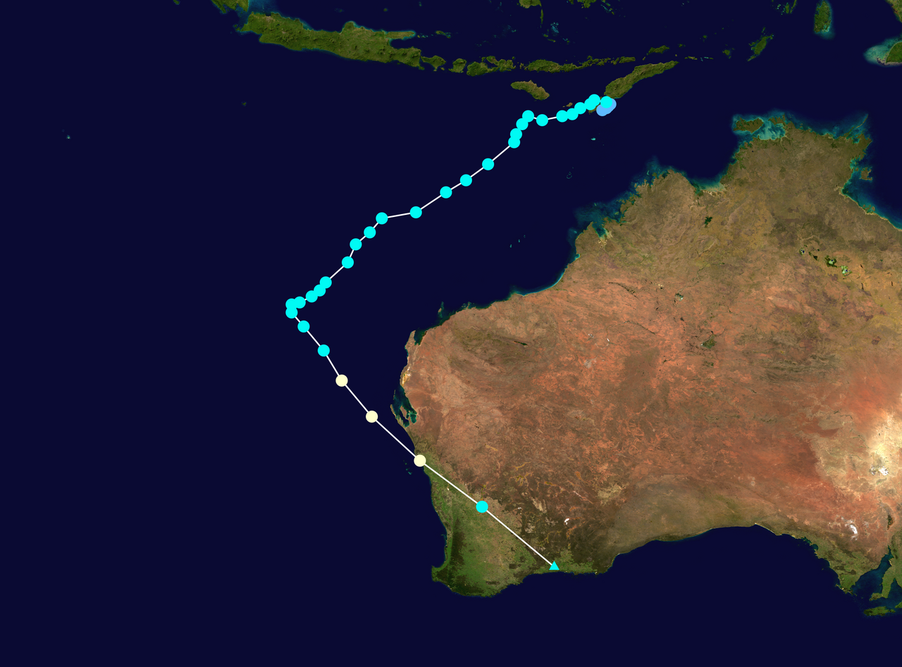

# Understanding the Script

## Introduction
In SWAN, script is the foundation for defining wave modeling simulations. In this section, a SWAN script example is provided to help users understand the structure and components of a typical SWAN input file. The script includes various sections such as model setup, input data, boundary conditions, initial conditions, physical parameters, numerical schemes, output specifications, and simulation time settings. Each section is explained in detail to guide users in creating their own SWAN scripts for wave modeling simulations. <br>

## SWAN Script Example
This script perform wave simulation for the ==Tropical Cyclone Seroja== event that occurred from April 4 to April 7, 2021, in the region around East Nusa Tenggara, Indonesia. The script is designed to simulate wave conditions during this event using the SWAN model.


<figure markdown="span">
     
    <figcaption>Figure xx. Trajectory of Tropical Cyclone Seroja.</figcaption>
</figure>


### Part 1 Introduction

```
$ Skrip Simulasi Gelombang SWAN
$ Kasus = TC Seroja (4-7 April 2021)

! Pendahuluan
PROject 'Seroja' 'S1'
SET maxerr=1 NAUT
MODE NONSTAT TWOD
COORDINATES SPHE 
```
Project with title 'Seroja' and project code 'S1'. The maximum error is set to 1 and using NAUT (nautical mile) convention. The model is set to non-stationary (time-dependent) and two-dimensional. The coordinate system used is spherical (latitude and longitude).

### Part 2 Model Setup

```
! Detail Model (edit)
CGRID REG 110 -20 0 20 15 159 119 CIRCLE 36 0.05 1
! resolusi 1/8 km
```
Computational grid is defined as a regular grid with the specified geographic coordinates and grid spacing. The western boundary is at 110°E, the southern boundary is at 20°S, and the tilting degree is 0°. The grid length is 20° in the x-direction and 15° in the y-direction, with a circular grid shape. So, the eastern boundary is ==110 + 20 = 130°E==, and the northern boundary is ==-20 + 15 = 5°S==. The grid has 159 grid points in the x-direction and 119 grid points in the y-direction, resulting in a total of 19080 grid points. The grid resolution is ==0.125° (approximately 13.9 km)== in both directions. The number of grid points in the x-direction is ==159 + 1 = 160==, and in y-direction is ==119 + 1 = 120==.  The circular grid is divided into ==36 grid==, so the grid interval is ==10°==. The minimum frequency is set to ==0.05 Hz== and the maximum frequency is set to ==1.0 Hz==. The grid covers an area of interest around the Seroja cyclone event.

### Part 3 Input Data

```
! Input = Batimetri (edit)
INPGRID BOT REGular 110 -20 0 4799 3599 0.004166666667 0.004166666667 &
READINP BOT -1.0 'batimetri_seroja.asc' 2 0 FREE 

! Input = Angin (edit)
INPGRID WIND REGular 110 -20 0 80 60 0.25 0.25 &
      NONSTAT 20210401.000000 1 HR 20210420.230000 
READINP WIND 1.00 SERI 'angin_seroja.wxy' 1 0 FREE 
```
Input data involves bathymetry (BOT/BOTTOM) and wind data (WIND). The bathymetry data is defined on a regular grid with the western boundary is at ==110°E==, the southern boundary is at ==20°S==, and the tilting degree is ==0°==. Bathymetry data is defined with a finer resolution of ==0.004166666667° (approximately 463 m)==. In the x-direction, the bathymetry data is defined with ==4800 (4799 + 1)== grid points, and in the y-direction, it is defined with ==3600 (3599 + 1)== grid points. The bathymetry data is read from the file 'batimetri_seroja.asc' and is in free format. 
The wind data is defined on a regular grid with a coarser resolution of ==0.25° (approximately 27.8 km)== and is non-stationary, covering the period from April 1, 2021, to April 20, 2021, with hourly intervals. The wind data is read from the file 'angin_seroja.wxy' and is in free format. This data uses Serial mode, which means that the data is read sequentially for each time step during the simulation. There is a main file (angin_seroja.wxy) that contains the list of files for each time step, and the data is read in a series of files corresponding to each time step.

### Part 4 Boundary and Initial Condition

```
! Boundary Condition
BOUND SHAPE JON	3.3 MEAN
!BOUNndest1 NEst 'bound2_2' CLOSed
									
! -----Initial Condition-----
INITIAL ZERO
```
Boundary condition data is not provided in this script, but the boundary's shape of the spectra is set to JONSWAP shape with gamma (peak enhancement spectrum)= 3.3. The mean wave period is used as the characteristic of wave period. The initial condition is set to zero, which means that the model starts with no waves at the beginning of the simulation. This allows the model to simulate the development of waves from the specified wind conditions over time.

### Part 5 Physical Parameters and Numerical Schemes

```
! Parameter Fisis
GEN3 KOMEN DRAG FIT AGROW 
TRIAD
WCAP KOMEN
DIFFRAC
FRICTION
BRE

! Skema Numerik
PROP BSBT
NUM ACCUR npnts=95. NONSTAT mxitns=5 DIRIMPL cdd=1
```
This section defines the physical parameters and numerical schemes used in the simulation. The physical parameters include the ==third-generation wave model (GEN3)== with the Komen wind linear growth and the wind drag coefficient is based on second order polynomial fit (Zijlema et al., 2012). The nonlinear wave-wave interactions are calculated using the triad interaction approximation (TRIAD). The whitecapping dissipation is based on the Komen formulation (WCAP KOMEN). The diffraction is included in the simulation (DIFFRAC), as well as bottom friction (FRICTION) and depth-induced breaking (BRE). <br>
The numerical scheme for wave propagation is the ==backward space backward time method (PROP BSBT)==. The numerical accuracy is set to 95% (NUM ACCUR npnts=95), and the maximum number of iterations for the non-stationary simulation is set to 5 (NONSTAT mxitns=5). The central scheme is used for the refraction propagation (DIRIMPL cdd=0). These settings ensure that the model accurately simulates the wave dynamics while maintaining computational efficiency. 


### Part 6 Output Settings

```
! Lokasi Output (edit) 
POINTs 'L_Sawu' 122.5 -9.5
POINTs 'S_Hindia' 117 -12
POINTs 'Aus' 122.5 -15

! Output = Time Series (edit)
Table 'L_Sawu' NOHEAD 'L_Sawu.tbl' TIME XP YP HS TM01 DIR WIND WATLEV OUTPUT 20210403.000000 1 HR
Table 'S_Hindia' NOHEAD 'S_Hindia.tbl' TIME XP YP HS TM01 DIR WIND WATLEV OUTPUT 20210403.000000 1 HR
Table 'Aus' NOHEAD 'Aus.tbl' TIME XP YP HS TM01 DIR WIND WATLEV OUTPUT 20210403.000000 1 HR

! Output = Spasial (edit)
BLOCK 'COMPGRID' NOHEAD 'HSig.mat' LAY 1 HS OUTPUT 20210403.000000 1 HR
BLOCK 'COMPGRID' NOHEAD 'HSwell.mat' LAY 1 HSWELL OUTPUT 20210403.000000 1 HR
BLOCK 'COMPGRID' NOHEAD 'Direction.mat' LAY 1 DIR OUTPUT 20210403.000000 1 HR
BLOCK 'COMPGRID' NOHEAD 'TM01.mat' LAY 1 TM01 OUTPUT 20210403.000000 1 HR
BLOCK 'COMPGRID' NOHEAD 'Wind.mat' LAY 1 WIND OUTPUT 20210403.000000 1 HR
BLOCK 'COMPGRID' NOHEAD 'Lon.mat' LAY 1 XP OUTPUT 20210403.000000 1 HR
BLOCK 'COMPGRID' NOHEAD 'Lat.mat' LAY 1 YP OUTPUT 20210403.000000 1 HR
BLOCK 'COMPGRID' NOHEAD 'Batimetri.mat' LAY 1 DEPTH OUTPUT 20210403.000000 1 HR
```

This section specifies the output settings for the simulation. Three points of interest for time series output are defined for output: 'L_Sawu' at (122.5°E, 9.5°S), 'S_Hindia' at (117°E, 12°S), and 'Aus' at (122.5°E, 15°S). The output will be saved in the respective .tbl files. The output parameters are time, longitude, latitude, significant wave height, mean wave period, wave direction, wind speed, and water level, extracted from 00 UTC 20210403 with a time step of 1 hour. <br>
In addition to time series output, spatial output is also specified for the entire computational grid (COMPGRID). The output parameters include significant wave height (HSig), swell wave height (HSwell), wave direction (Direction), mean wave period (TM01), wind speed (Wind), longitude (Lon), latitude (Lat), and bathymetry (Batimetri). These outputs will be saved in .mat files for further analysis and visualization. The spatial output is also extracted from 00 UTC 20210403 with a time step of 1 hour. This allows for a comprehensive analysis of the wave conditions across the entire model domain during the simulation period.


### Part 7 Simulation Time Settings
```
! Setting Waktu Simulasi (edit)
COMP NONST 20210401.000000 1 HR 20210410.230000 
STOP
```
The simulation is set to run in non-stationary mode (COMP NONST) from April 1, 2021, at 00:00 UTC to April 10, 2021, at 23:00 UTC, with a time step of 1 hour. The STOP command indicates the end of the script. This time setting allows for the simulation of wave conditions during the period of interest around the Seroja cyclone event.